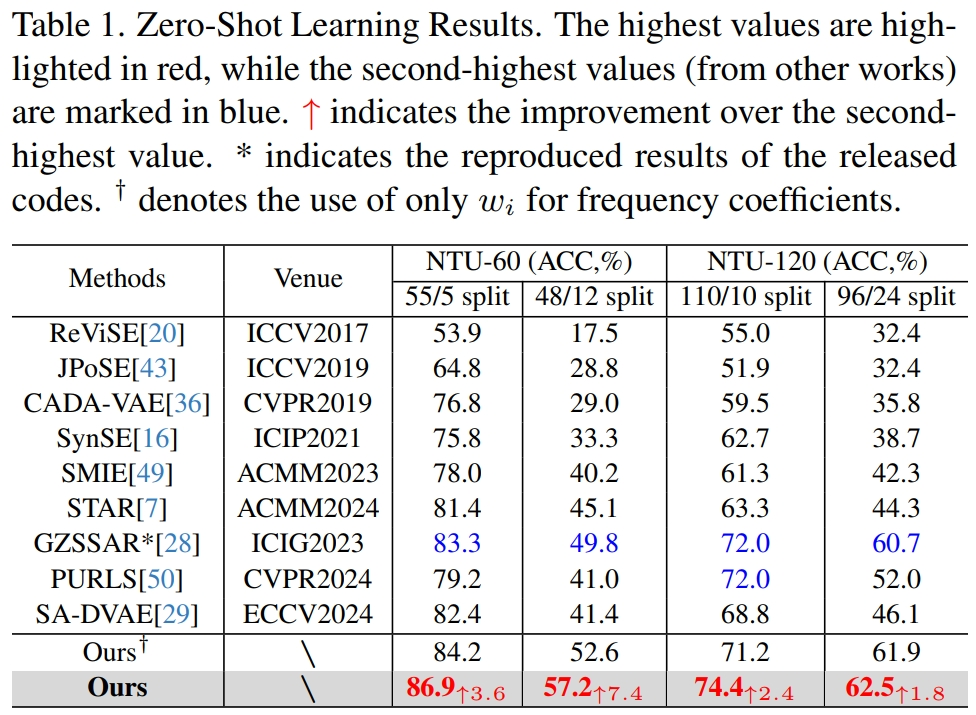
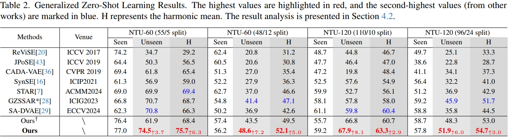

# Frequency-Semantic Enhanced Variational Autoencoder for Zero-Shot Skeleton-based Action Recognition [ICCV2025]
[Wenhan Wu](https://sites.google.com/view/wenhanwu/%E9%A6%96%E9%A1%B5), [Zhishuai Guo](https://zhishuaiguo.github.io/), [Chen Chen](https://www.crcv.ucf.edu/chenchen/), [Hongfei Xue](https://havocfixer.github.io/), [Aidong Lu ](https://webpages.charlotte.edu/alu1/)

[](https://github.com/wenhanwu95/FS-VAE)

## Abstract
Zero-shot skeleton-based action recognition aims to develop models capable of identifying actions beyond the categories encountered during training. Previous approaches have primarily focused on aligning visual and semantic representations but often overlooked the importance of fine-grained action patterns in the semantic space (e.g., the hand movements in drinking water and brushing teeth). To address these limitations, we propose a Frequency-Semantic Enhanced Variational Autoencoder (FS-VAE) to explore the skeleton semantic representation learning with frequency decomposition. FS-VAE consists of three key components: 1) a frequency-based enhancement module with high- and low-frequency adjustments to enrich the skeletal semantics learning and improve the robustness of zero-shot action recognition; 2) a semantic-based action description with multilevel alignment to capture both local details and global correspondence, effectively bridging the semantic gap and compensating for the inherent loss of information in skeleton sequences; 3) a calibrated cross-alignment loss that enables valid skeleton-text pairs to counterbalance ambiguous ones, mitigating discrepancies and ambiguities in skeleton and text features, thereby ensuring robust alignment. Evaluations on the benchmarks demonstrate the effectiveness of our approach, validating that frequency-enhanced semantic features enable robust differentiation of visually and semantically similar action clusters, thereby improving zero-shot action recognition.

## Overall Design

The overall design of our frequency-semantic enhanced variational autoencoder for zero-shot skeleton action recognition. The main contributions are: 
- **Frequency Enhanced Module:**  
  We propose a Frequency Enhanced Module that employs Discrete Cosine Transform (DCT) to decompose skeleton motions into high- and low-frequency components, allowing adaptive feature enhancement to improve semantic representation learning in ZSSAR.

- **Semantic-based Action Description (SD):**  
  We introduce a novel Semantic-based Action Description (SD), comprising Local action Description (LD) and Global action Description (GD), to enrich the semantic information for improving the model performance.

- **Calibrated Cross-Alignment Loss:**  
  A Calibrated Cross-Alignment Loss is proposed to address modality gaps and skeleton ambiguities by dynamically balancing positive and negative pair contributions. This loss ensures robust alignment between semantic embeddings and skeleton features, improving the model's generalization to unseen actions in ZSSAR.

- **Extensive Experiments:**  
  Extensive experiments on benchmark datasets demonstrate that our framework significantly outperforms state-of-the-art methods, validating its effectiveness and robustness under various seen-unseen split settings.


## Our Approach

Overview of the proposed FS-VAE. The frequency-enhanced module integrates the global and fine-grained skeleton utilizing the low-frequency and high-frequency adjustments. The semantic-based action descriptions, including action labels, local action descriptions, and global action descriptions, are introduced to generate comprehensive semantic embeddings for cross-alignment. Moreover, the novel calibrated loss in the cross-alignment module is proposed for minimizing the disparity between semantic and skeletal features.

## Results

<p align="center">
  
</p>
<p align="center">
  
</p>


## Latest Updates:
* Create the GitHub repository and project website on 2025/6/26
* Arxiv and Codes are coming soon!


For any questions, feel free to create a new issue or contact:
```
Wenhan Wu: wwu25@uncc.edu
```
